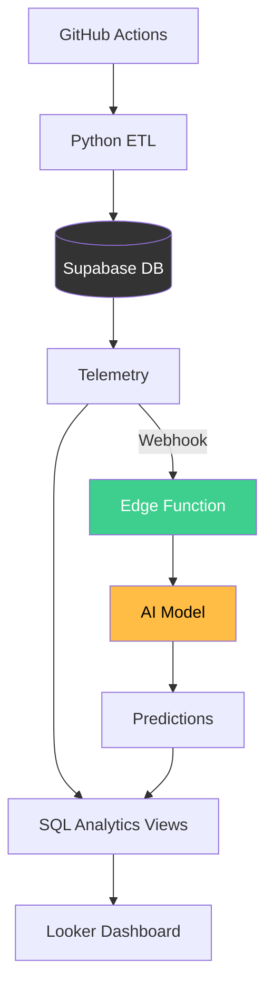

# National Grid Telemetry Pipeline
Production-grade ETL & AI Analytics tracking UK grid carbon intensity and generation mix.

## 🚀 The High-Level Architecture

## ✨ Key Engineering Highlights
### 1. Production-Ready ETL
**Resiliency**: Implemented Python decorators for exponential backoff and retries to handle National Grid API rate limits.

**Observability**: Every run is logged in an etl_runs table, tracking execution time, row counts, and error stack traces for fast debugging.

**Automation**: Fully automated via GitHub Actions, running every 30 minutes with zero manual intervention.

### 2. Advanced SQL & Data Integrity
**Dynamic Data Completion**: Created a SQL analytics layer that automatically calculates an "Other" fuel category. This ensures the generation mix always sums to exactly 100%, even when the API data is incomplete.

**Performance Optimization**: Leveraged Postgres Expression Indexes and composite keys to ensure 24-hour dashboard views remain responsive under heavy data loads.

**Time-Series Join**: Built complex views to align real-time telemetry with AI-generated forecasts, enabling instant "Actual vs. Predicted" error analysis.

### 3. AI-Driven Forecasting
**Model**: Integrated Hugging Face Chronos (a state-of-the-art time-series model).

**Serverless Flow**: Triggered via Supabase Webhooks and Edge Functions, creating a completely event-driven forecasting pipeline.

## 📊 Dashboard
**Live Reporting**: View the [Looker Studio Dashboard](https://lookerstudio.google.com/reporting/17d54e78-beda-4a69-b965-c3a95cf9848f)

## 🛠️ Tech Stack
- **Language**: Python (pandas, psycopg2, pytest)
- **Database**: PostgreSQL (Supabase)
- **Infrastructure**: GitHub Actions, Supabase Edge Functions
- **AI/ML**: Hugging Face Chronos
- **Visualization**: Looker Studio
